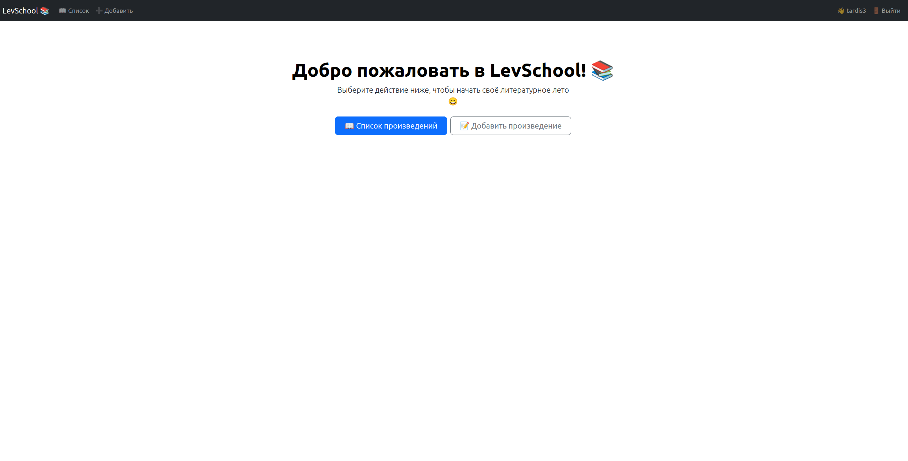

# LevSchool
## Build & Run

```bash
git clone https://github.com/levBagryansky/LevSchool.git
cd LevSchool
pip install -r requirements.txt
python3 manage.py migrate
python3 manage.py runserver
```

Visit http://127.0.0.1:8000 in your browser.

